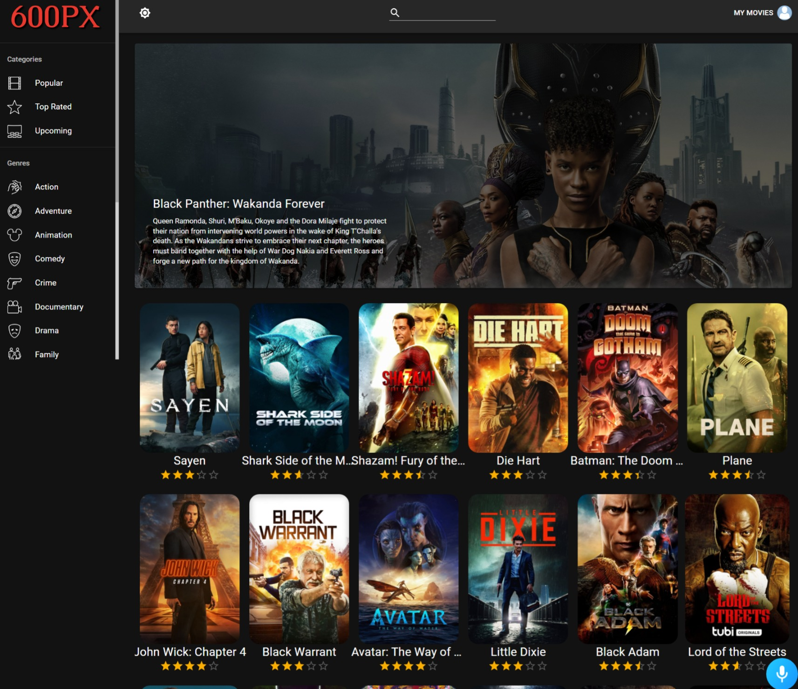
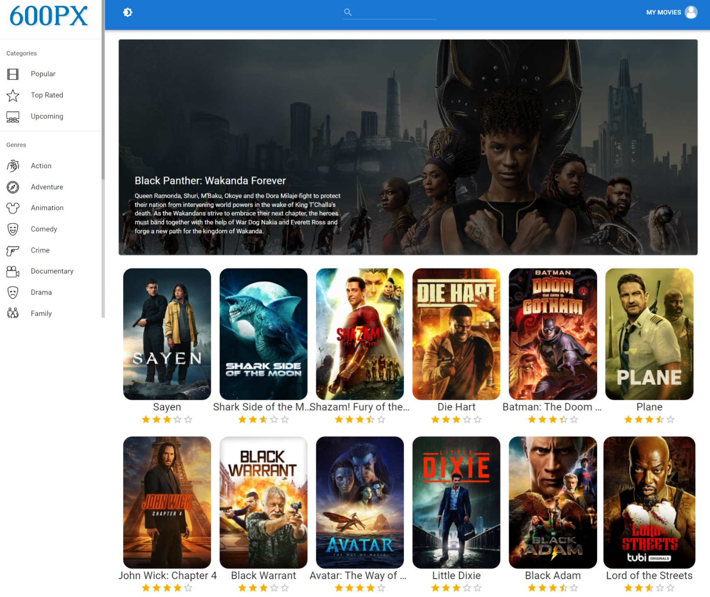
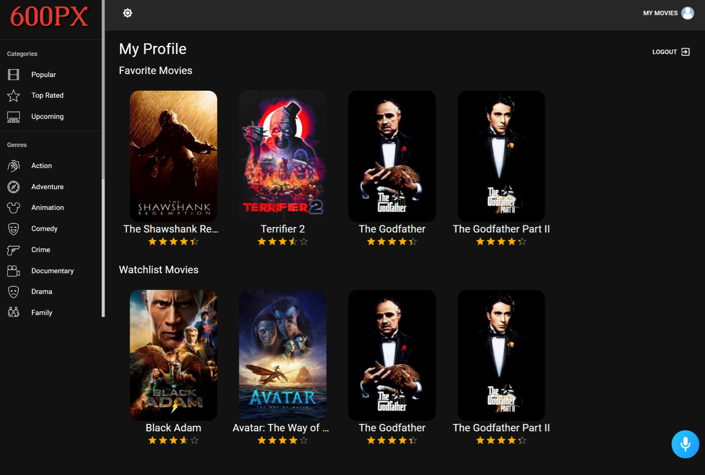
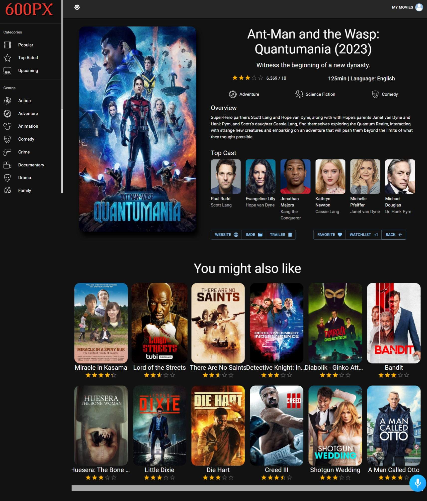
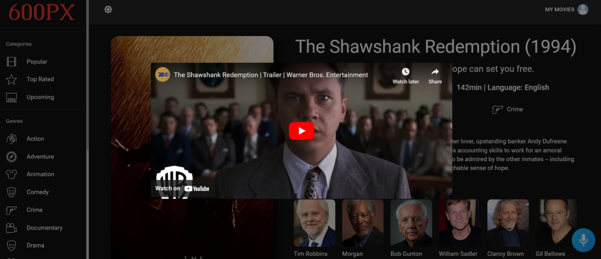
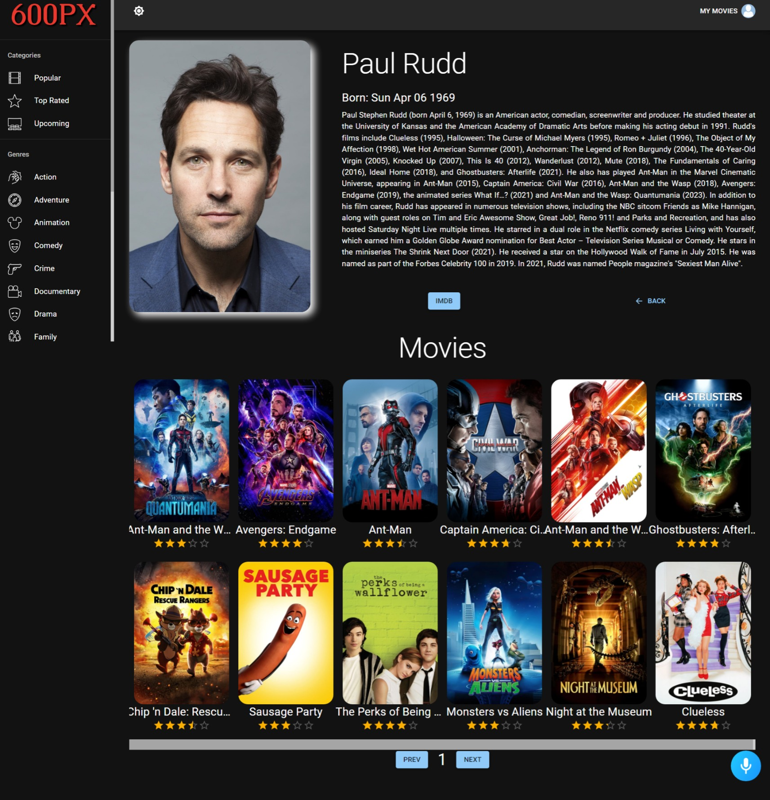

# 600px

[Live Application](https://600pxnihal.netlify.app/) 

- 600px is an movie streaming app. Users can search for movies and learn about movies, as well as the cast of the movie. Navigating through the application is made simple with help of a AI voice chatbot. 600px also provides ratings of movies.It uses TMDB API to fetch live real time movies.

- 600px uses Alan AI to give the website life, ask Alan "what does this app do?","Make it dark","Make it light","Login","Logout","Go to top rated","Go to Popular"."Go to Comedy","Go to Horror","Surprise Me","Search for Blackpanther",etc..

- 600px combines the desire to unleash powerful creativity with the industry's most advanced JavaScript tools including React.js, Redux, Material UI, Alan AI, and more.

- This application includes user authentication, dark mode, sort movie on the basis of categories or genres, viewing movie and actor details, adding a movie to favorites or watchlist and many more functionalities.

## Screenshots
### Dark Mode


### Light Mode


### User Profile - Favorited and Watchlisted Movies

You can mark movies as favourite and add them to your watchlist. Your favourite and watchlisted movies list can be viewed on your profile page.  



### Movie Details

You can take a look at a specific movie's details, cast and similar movies.   

  

### Movie Trailer

You can watch the movie's trailer

  

### Cast Details

You can also take a look at a specific cast details and their movies.  

 


<!-- GETTING STARTED -->
## Getting Started

To get a local copy up and running follow these simple steps.

### Prerequisites

List of things you need to use and how to install them:
* npm
  ```sh
  npm install npm@latest -g
  ```

### Installation

Setup:

1. Get a free TMDB API Key at [https://www.themoviedb.org/](https://www.themoviedb.org/).
2. Clone the repo:
   ```sh
   git clone https://github.com/Nihaljain-10/600px.git
   ```
3. Install NPM packages:
   ```sh
   npm install
   ```
4. Create your `.env` file as it is instructed in `.env.example`.
5. Enter your TMDB API key in your `.env`.

   ```sh
   REACT_APP_TMDB_KEY=<put your key here>
   ```

<!-- USAGE EXAMPLES -->
## Usage

For a full demonstration of all the functionalities of this phenomenal web application check out this [demo site](https://600pxnihal.netlify.app/).

_For more detailes regarding TMDB API calls, please refer to the [Documentation](https://developers.themoviedb.org/3/getting-started/introduction)._

<!-- ACKNOWLEDGMENTS -->
## Acknowledgments

Used resources:

* [The Movie DB API Documentation](https://developers.themoviedb.org/3/getting-started/introduction)
* [Alan AI Documentation](https://alan.app/docs/)
* [MUI Library](https://mui.com/)

